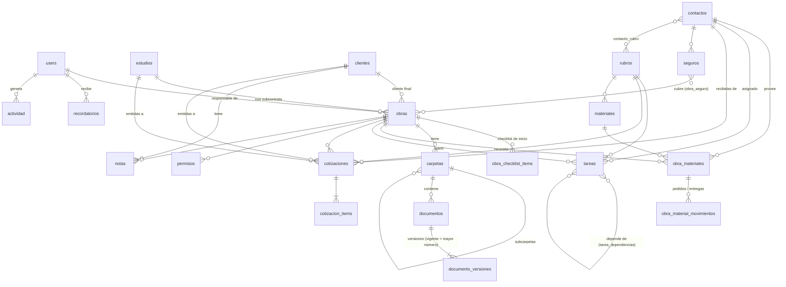

# Base de datos

MySQL/MariaDB en producción (Hostinger). Migraciones en `database/migrations/2026_10_04_*`.

Polimórficas (guardan `tipo` + `id`, con nombres cortos definidos en `AppServiceProvider`):

- `adjuntos` → permisos, seguros, cotizaciones.
- `recordatorios.recordable` → obra, permiso, seguro, cotización, etc.
- `actividad.sujeto` → cualquier entidad (auditoría).

## Decisiones

| Tema | Decisión |
|---|---|
| Subcontratación | `estudios` = estudios que nos pasan obras. Cada obra tiene `estudio_id` (null = obra directa), `codigo_estudio` (cómo la identifican ellos) y `cliente_id` (comitente final). |
| Última versión de un archivo | `documento_versiones` con `numero` incremental; la vigente es la de número mayor. Las anteriores quedan como historial. |
| Materiales | Necesito / pedí / entregaron se calcula desde `obra_material_movimientos`, así se soportan entregas parciales y queda registro de quién, cuándo y con qué remito. |
| Cotizaciones | Una sola tabla con `tipo` = `recibida` (de un contacto) o `emitida` (a un cliente). `obra_id` es opcional para presupuestos previos a la obra. |
| Moneda | `ARS` o `USD` por cotización y por seguro, con `tipo_cambio` opcional. |
| Seguros | Un seguro pertenece a un contacto y puede cubrir varias obras. |
| Inicio de obra | Datos de la obra + checklist que se copia desde `checklist_plantilla_items` (editable). |
| Permisos de acceso | 3 usuarios del estudio, todos ven todo. Roles `admin` (gestiona usuarios y plantillas) y `miembro`. |
| Borrado | Borrado lógico (`deleted_at`) en entidades principales. |
| Archivos | Se guardan fuera de `public_html` y se sirven solo a usuarios autenticados. |
